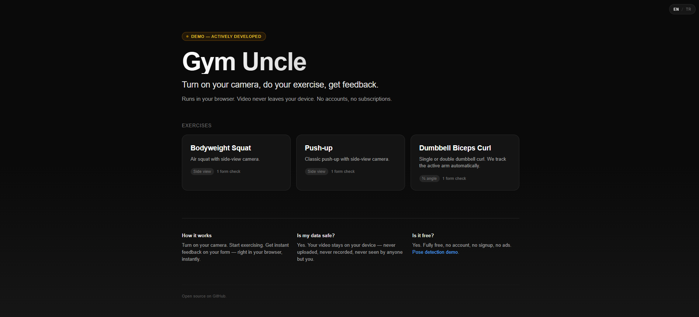
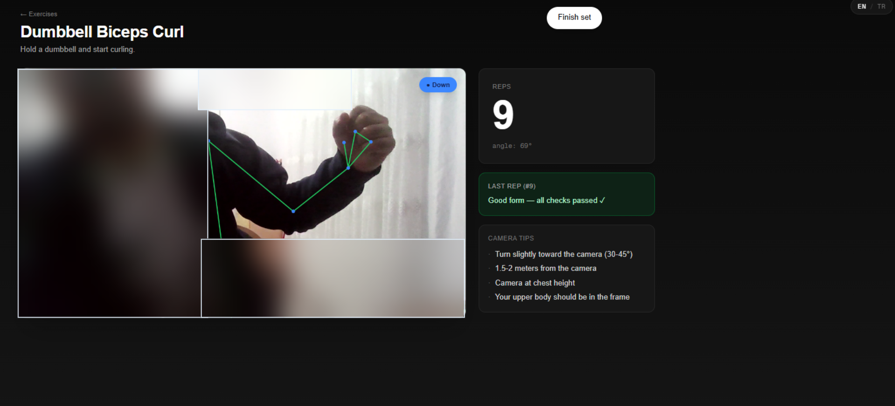
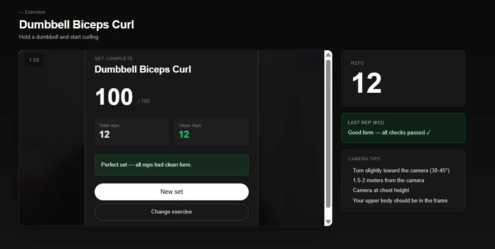

# Gym Uncle / Salon Abisi

> Free, in-browser exercise form analysis. Your video never leaves your device.

## Live demo

- **Primary:** [salon-abisi.pages.dev](https://salon-abisi.pages.dev) (Cloudflare Pages)
- **Mirror:** [tevfikmetinn.github.io/Salon-Abisi](https://tevfikmetinn.github.io/Salon-Abisi/) (GitHub Pages)

**Languages:** English · Türkçe (in-app toggle)

---

## What it does

Point your webcam at yourself, do bodyweight exercises, get instant form feedback:

- **Real-time pose detection** in the browser, no installs
- **Auto rep counting** for squats, push-ups, and biceps curls
- **Form checks** with simple, coaching-style feedback
- **Set summary** with score and stats
- **Bilingual** (EN/TR, single-tap toggle)
- **100% private** — your video stays on your device

## Screenshots

| Home | Live exercise | Set summary |
|------|---------------|-------------|
|  |  |  |

## Currently supported exercises

| Exercise | Camera | Form checks |
|---|---|---|
| Bodyweight Squat | Side view | Depth |
| Push-up | Side view, low angle | Depth |
| Dumbbell Biceps Curl | ¾ angle | Range of motion |

## Tech stack

- **Next.js 16** (App Router) + React 19
- **MediaPipe Tasks Vision** for pose detection (runs in WebAssembly)
- **Tailwind CSS 4**
- **TypeScript** (strict mode)
- **Vitest** for unit tests
- Deployed on **Cloudflare Pages** + **GitHub Pages**

Everything runs client-side. No backend, no databases, no analytics.

## Run locally

Requires Node.js 20+.

```bash
git clone https://github.com/tevfikmetinn/Salon-Abisi.git
cd Salon-Abisi/formkocu
npm install
npm run dev
```

Open [http://localhost:3000](http://localhost:3000).

### Other scripts

```bash
npm run build # production build (static export → out/)
npm run test # tests in watch mode
npm run test:run # tests, single run
npm run lint # eslint
```

## Project structure

```
Salon-Abisi/
├── README.md
├── FUTURE.md # planned improvements
├── docs/ # design docs (currently in Turkish)
├── .github/workflows/ # CI / GitHub Pages deploy
└── formkocu/ # Next.js app
 └── src/
 ├── app/ # pages
 ├── core/ # engine: pose, exercise, math
 ├── exercises/ # plugins: squat, pushup, curl
 ├── lib/i18n/ # EN/TR translations
 └── components/
```

## Roadmap

See [FUTURE.md](FUTURE.md). Short version:
- More exercises (plank, lunge, glute bridge)
- More form checks per exercise
- Session history (still local-only)
- Audio cues

## Why "Gym Uncle" / "Salon Abisi"?

In Turkish gym culture, the _"salon abisi"_ is the slightly older, more experienced lifter who quietly tells you how to fix your form when you're about to hurt yourself. This is a digital one.

## License

MIT. Use it, fork it, ship it.

---

_Demo version — actively developed. Feedback and contributions welcome._
